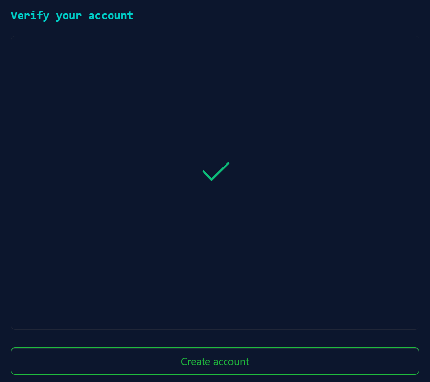
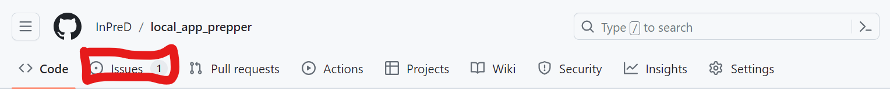

# Bioinformatics session

A two-day workshop for bioinformaticians and molecular biologists with focus on the TSO500 pipeline in InPreD


---

## Overview

1. Setup
2. Development & Collaboration
3. Nextflow
4. tso500_nxf_workflow
5. Python

---

## 1. Setup

---

## Create a GitHub account

- go to <https://github.com/> and click on `Sign up`


---

## Create a GitHub account

- enter your email


---

## Create a GitHub account

- set a password


---

## Create a GitHub account

- choose a username


---

## Create a GitHub account

- choose email preferences


---

## Create a GitHub account

- solve the puzzle


---

## Create a GitHub account

- create your account



---

## Create a GitHub account

- find the activation code in the email you received


---

## Create a GitHub account

- select the desired options


---

## Create a GitHub account

- choose the free plan


---

## 1. Setup

## Be added to InPreD organisation at GitHub

---

## 1. Resources

- [Getting started with your GitHub account](https://docs.github.com/en/get-started/onboarding/getting-started-with-your-github-account)

---

## 2. Development & Collaboration

### Short `git` introduction

- distributed version control system
- tracks history of changes commited by different contributors
- every developer has full copy of project and its history

---

### Short `git` introduction

#### Basic `git` commands

`git init`: initialises new git repository

`git clone <repository url>`: creates local copy of remote repository

`git add <file/s>`: stage new or changed files (anything that should be committed to the repository)

`git commit -m "feat: my new feature"`: commit changes to the repository

---

#### Basic `git` commands

##### commit message conventions

`<type>[optional scope]: <description>`

- `feat`: new feature
- `fix`: patching bug
- `refactor`: code change that neither is neither feat nor fix
- `build`: build system related changes
- `perf`: improving performance

---

##### commit message conventions

`<type>[optional scope]: <description>`

- `chore`: code unrelated changes, e.g. dependencies
- `style`: code change that does not change meaning
- `test`: changes to tests
- `docs`: adding/updating documentation
- `ci`: continuous integration, e.g. github actions

---

#### Basic `git` commands

`git status`: overview over untracked, modified and staged changes

`git branch`: show local branches

`git merge`: merge branches

`git pull`: load changes from remote counterpart

`git push`: upload changes to remote counterpart

---

## 2. Development & Collaboration

### Branching model: simplied Gitflow workflow

- start with two branches to record project history: `main` and `develop`
- each new feature resides in its own branch (feature branch)
- feature branch is generally created off latest `develop` commit
- upon feature completion, feature branch is merged into `develop`

---

### Branching model: simplied Gitflow workflow


---

## 2. Development & Collaboration

### GitHub Actions

- continuous integration (CI) and continuous deployment (CD)
- building, testing and deploying directly from GitHub
- set up by adding yaml instructions to `.github/workflows`

```yaml
name: GitHub Actions Demo
on: [push]
jobs:
  Explore-GitHub-Actions:
    runs-on: ubuntu-latest
    steps:
      - run: echo "Hello world!"
```

---

### GitHub Actions

```yaml
name: Docker Build
on:
  push:
    branches:
      - main
      - develop
    tags:
      - '*.*.*'

jobs:
  test:
    name: Run unit tests
    runs-on: ubuntu-latest
    steps:
      - 
        name: Check out the repo
        uses: actions/checkout@v4
      - 
        name: Unit testing 
        uses: fylein/python-pytest-github-action@v2
        with:
          args: pip3 install -r requirements.txt && pytest
  ...
  ```

---

### GitHub Actions

```yaml
...
  build:
    name: Build Image
    runs-on: ubuntu-latest
    needs: test
    steps:
      - 
        name: Check out the repo
        uses: actions/checkout@v4
      -
        name: Lint Dockerfile
        uses: hadolint/hadolint-action@v3.1.0
      - 
        name: Docker Meta
        id: meta
        uses: docker/metadata-action@v5
        with:
          images: |
            inpred/local_app_prepper
          tags: |
            latest
            type=semver,pattern={{version}}
            type=semver,pattern={{major}}.{{minor}}
            type=semver,pattern={{major}}
      - 
        name: Login to Dockerhub
        uses: docker/login-action@v3
        with:
          username: ${{ secrets.DOCKERHUB_USERNAME }}
          password: ${{ secrets.DOCKERHUB_TOKEN }}
      - 
        name: Build and push image to Docker Hub
        uses: docker/build-push-action@v5
        with:
          push: true
          tags: ${{ steps.meta.outputs.tags }}
          labels: ${{ steps.meta.outputs.labels }}
```

---

### GitHub Actions


---

### GitHub Actions


---

### GitHub Actions


---

## 2. Development & Collaboration

### GitHub workflow

- go to issues and create a `New issue`




---

### GitHub workflow

- give the issue a descriptive title and a description and `Submit new issue`


---

### GitHub workflow

- if you decide to work on the issue (own repository), `Create a branch` via the issue


---

### GitHub workflow

- `Change branch source` to `develop` and `Create branch`


---

### GitHub workflow

- load the new branch to your local repository, check it out and start working
- push your changes back to the remote

```bash
$ git pull
$ git checkout 4-new-fancy-feature
$ git add README.md
$ git commit -m "docs: updating docs"
$ git push
```

---

### GitHub workflow

- for repositories you don't have access to, create a fork


---

### GitHub workflow


---

### GitHub workflow

- once you have a fork, `git clone` your forked repository
- create a new branch and work on that
- `git push` your changes back to the forked remote

---

### GitHub workflow

- when you are done, go to pull requests and create a `New pull request`


---

### GitHub workflow

- choose `develop` as `base` and your new feature branch for `compare`


---

### GitHub workflow

- `assign yourself`, add at least one reviewer (cog icon), provide some context and `Create pull request`


---

### GitHub workflow

- if you still want to work on the pull request, you can `Convert to draft` to let the reviewers know that it is not done yet
- otherwise you can just wait for them to review your changes


---

### GitHub workflow

- as a reviewer, make your you check your email notifications to see if there is pull requests waiting for you
- open the pull request and start the review in the `Files changed` tab


---

### GitHub workflow

- you can leave comments and suggestions in the code by hovering over the line with the changes and clicking on `+`


---

### GitHub workflow

- you can type your comment


---

### GitHub workflow

- or you leave a suggestion, ideally you click `Start a review` to initialise the reviewing process


---

### GitHub workflow

- when you are done with reviewing, `Finish your review`


---

### GitHub workflow

- again, leave a comment if you like, and choose if you just want to `Comment`, `Approve` or `Request changes`


---

### GitHub workflow

- you can add a general comment to the pull request under `Conversation`


---

### GitHub workflow

- after the reviewer left their comments and suggestions, you can address them one by one by replying or applying the suggested changes
- whenever a certain comment/suggestion is handled (discussion comes to conclusion, suggestion was applied), you can resolve it


---

### GitHub workflow

- as soon as the reviewers gave you an approval, you can finally `Merge pull request`


---

## 2. Development & Collaboration

### Release

- releases should be from `main` branch
- good practice is to open a pull request for `develop` into `main` when you are done with the desired features

---

### Release

- whenever you are ready for a new release, `create a new release`


---

### Release

- add a title and a description for your release and `Choose a tag`


---

### Release

- ideally, you choose a tag according to semantic versioning


---

### Release

#### Semantic versioning

- version tag should be **MAJOR.MINOR.PATCH**
- you increment one of the three depending on the change
  - **MAJOR**: version when you make incompatible API changes
  - **MINOR**: version when you add functionality in a backward compatible manner
  - **PATCH**: version when you make backward compatible bug fixes

---

### Release

- when you are satisfied with your release, `Publish release`


---

## 2. Development & Collaboration

### Licensing

- let's discuss


---

## 2. Resources

- [About Git](https://docs.github.com/en/get-started/using-git/about-git)
- [Gitflow workflow](https://www.atlassian.com/git/tutorials/comparing-workflows/gitflow-workflow)
- [GitHub Actions](https://docs.github.com/en/actions/quickstart)
- [Semantic versioning](https://semver.org/)
- [Licensing](https://choosealicense.com/)

---

## 3. Nextflow

### Short introduction

- workflow manager that enables scalable and reproducible scientific workflows using software containers
- an extension of groovy which is object-oriented programming language for the Java platform
- **nf-core**: project/community that develops framework for nextflow including guidelines, tools, modules, subworkflows, pipelines and test data

---

## 3. Nextflow

### Requirements

- POSIX compatible system (e.g. Linux, Os X)
- Bash
- Java ≥ 11 / ≤ 21
- Docker/Singularity

---

## 3. Nextflow

### Installation

```bash
$ curl -s https://get.nextflow.io | bash
$ chmod +x nextflow
```

or

```bash
$ wget -O nextflow https://github.com/nextflow-io/nextflow/releases/download/v23.10.1/nextflow-23.10.1-all
```

or via browser at <https://github.com/nextflow-io/nextflow/releases>

---

## 3. Nextflow

### Something

- stubbing

---

## 3. Nextflow

### nf-core template

---

## 3. Resources

- [nextflow.io](https://nextflow.io/)
- [nf-co.re](https://nf-co.re/)
- [nf-core github](https://github.com/nf-core)

---

## 4. `tso500_nxf_workflow`

### Status update

- modified nf-core template (removed unnecessary functionality, config and metadata files)
- added devcontainer to have controlled environment (dind and sind available)
- stubbing data available
- containing three modules so far (`localapp_prepper`, `LocalApp`, `dumpsoftwareversions`)
- using nf-validation plugin

---

## 4. `tso500_nxf_workflow`

### Overview


---

## 4. `tso500_nxf_workflow`

### Demonstration

---

## 4. `tso500_nxf_workflow`

### Outlook

- `samplesheet_generator`
- `tsoppi` (requires some restructuring)
- `PRONTO`
- include configuration files for each node
- Documentation

---

## 4 Resources

- [repository](https://github.com/InPreD/tso500_nxf_workflow)
- [local_app_prepper](https://github.com/InPreD/local_app_prepper)
- [samplesheet_generator](https://github.com/InPreD/samplesheet_generator)

---

## 5. Python

- general (best practice, cli)
- unit testing (pytest)

--- 

### Resources

- [nf-core](https://nf-co.re/)
- [pytest unittesting](https://www.datacamp.com/tutorial/pytest-tutorial-a-hands-on-guide-to-unit-testing)
